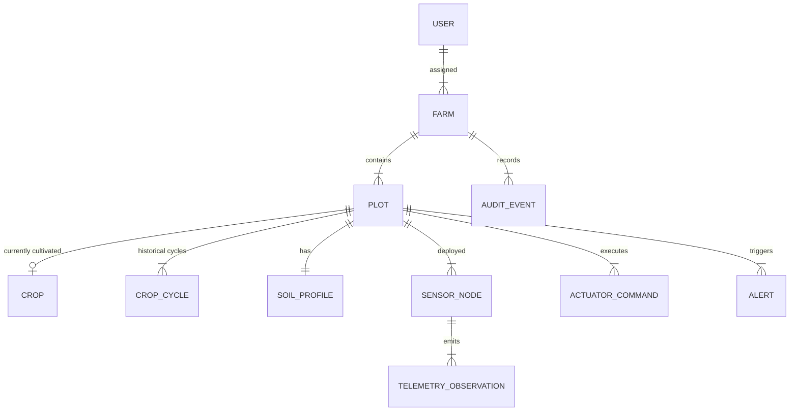

# AGRITWIN — DATA ARCHITECTURE SPECIFICATION

## 1. Executive Summary & Core Principle
AgriTwin is a unified, reactive Agricultural Digital Twin platform. The application enforces a **Single Source of Truth** architecture across all views (Dashboard, Virtual Farm, Map View, Analytics, Field Log, AI Advisor, Device Control, Sensors, Research Workspace, Crop Comparison, What-If Simulator, User Management). 

No individual UI view maintains isolated, hardcoded, or duplicated domain state. Every entity change (Farm, Plot, Crop, Sensor, Telemetry, Actuator Command, Alert, User Role) propagates automatically to every dependent view through a centralized domain service layer and reactive global store.

---

## 2. Canonical Domain Entity Model



### Entity Contracts & Interfaces (`src/domain/models/`)

#### A. Farm (`Farm.ts`)
```typescript
export interface Farm {
  id: string;                  // e.g. "farm_iiit_dharwad"
  name: string;                // e.g. "IIIT Agricultural Research Farm"
  location: string;            // e.g. "Dharwad, Karnataka"
  totalArea: number;           // e.g. 20
  unit: 'acres' | 'hectares';  // e.g. "acres"
  sectionsCount: number;       // e.g. 4
  createdAt: string;
  updatedAt: string;
}
```

#### B. Plot / Section (`Plot.ts`)
```typescript
export interface Plot {
  id: string;                         // e.g. "sec_a_tomato"
  farmId: string;                     // Linked Farm ID
  code: string;                       // e.g. "SEC-A"
  name: string;                       // e.g. "Section A - Tomato"
  area: number;                       // e.g. 5
  areaUnit: string;                   // e.g. "acres"
  areaSqm: number;                    // e.g. 20234.3
  cropId: string | null;              // Linked Crop ID
  activeCropCycleId: string | null;   // Linked Active CropCycle ID
  sensorNodeId: string;               // Linked Sensor Node ID
  boundaryCoordinates?: [number, number][]; // Geofence polygon
  soilMoisture: number;               // Latest %
  airTemp: number;                    // Latest °C
  soilPh: number;                     // Latest pH
  parLux?: number;                    // Latest lx
  daysPlanted: number;                // DAP
  isWatering: boolean;                // Actuator status
  hvacActive: boolean;                // Actuator status
  status: 'OPTIMAL' | 'WARM_STRESS' | 'MOISTURE_DEFICIT' | 'FALLOW';
  createdAt: string;
  updatedAt: string;
}
```

#### C. Crop Cultivar (`Crop.ts`)
```typescript
export interface Crop {
  id: string;                     // e.g. "crop_tomato_sarpan"
  name: string;                   // e.g. "Tomato"
  variety: string;                // e.g. "Sarpan F1-STH-520"
  growthDurationDays: number;     // e.g. 105
  waterRequirementLpd: number;    // e.g. 4.5 L/day
  idealMoistureMin: number;       // e.g. 55%
  idealMoistureMax: number;       // e.g. 75%
  idealTempMin: number;           // e.g. 20°C
  idealTempMax: number;           // e.g. 28°C
  idealPhMin: number;             // e.g. 6.0
  idealPhMax: number;             // e.g. 6.8
  gddBaseTemp: number;            // e.g. 10°C
  createdAt: string;
}
```

#### D. CropCycle (`CropCycle.ts`)
```typescript
export interface CropCycle {
  id: string;
  plotId: string;
  cropId: string;
  cropName: string;
  variety: string;
  startDate: string;
  expectedHarvestDate: string;
  actualHarvestDate?: string;
  accumulatedGdd: number;
  currentStage: 'Germination' | 'Vegetative' | 'Flowering' | 'Yielding' | 'Harvested';
  status: 'ACTIVE' | 'COMPLETED' | 'TERMINATED';
  createdAt: string;
}
```

#### E. TelemetryObservation (`TelemetryObservation.ts`)
```typescript
export type DataSourceType = 'MANUAL_PROTOTYPE' | 'SENSOR' | 'AI_ML' | 'DERIVED' | 'SIMULATION';

export interface TelemetryObservation {
  id: string;
  farmId: string;
  plotId: string;
  deviceId: string;
  sensorId: string;
  parameterKey: string;             // e.g. "soil_moisture"
  displayName: string;              // e.g. "Soil Volumetric Water Content"
  value: number;                    // e.g. 58.4
  unit: string;                     // e.g. "%"
  measurementTimestamp: string;
  receivedTimestamp: string;
  qualityStatus: 'VALID' | 'WARNING' | 'INVALID';
  dataSource: DataSourceType;
  metadata?: Record<string, any>;
}
```

#### F. DigitalTwinState (`DigitalTwinState.ts`)
```typescript
export interface DigitalTwinState {
  farmId: string;
  plotId: string;
  plotCode: string;
  cropState: {
    cropId: string | null;
    cropName: string;
    stage: string;
    dap: number;
    healthScore: number;
  };
  soilState: {
    moisturePct: number;
    tempC: number;
    ph: number;
    ecDsM?: number;
  };
  environmentState: {
    airTempC: number;
    humidityPct: number;
    solarRadWm2?: number;
    vpdKpa?: number;
  };
  actuatorState: {
    irrigationActive: boolean;
    hvacActive: boolean;
    growLightActive: boolean;
  };
  dataProvenance: {
    lastObservationId: string;
    dataSource: DataSourceType;
    updatedAt: string;
  };
}
```

---

## 3. Data Access Layer & Service Modularization Architecture

To eliminate scattered direct `localStorage` or `Firebase` calls, domain logic is partitioned into dedicated services in `src/domain/services/`:

```
src/domain/
├── models/
│   ├── Farm.ts
│   ├── Plot.ts
│   ├── Crop.ts
│   ├── TelemetryObservation.ts
│   └── DigitalTwinState.ts
├── services/
│   ├── FarmService.ts          # Farm CRUD & acreage math validation
│   ├── PlotService.ts          # Section partitioning & plot resizing
│   ├── CropService.ts          # Crop library management & GDD calculations
│   ├── TelemetryService.ts     # Telemetry ingestion, validation, & time series
│   ├── DigitalTwinService.ts   # Aggregates biophysical state for virtual farm & map
│   ├── ActuatorService.ts      # Command dispatching & ACK status handling
│   └── ResearchService.ts      # Raw dataset querying, filtering, & CSV/JSON export
└── state/
    └── AgriStore.tsx           # Global Reactive AppStore Context & Event Publisher
```

---

## 4. Single Source of Truth Application Flow

```
[ USER / INPUT SOURCE ]
       │
       ├── Admin Farm Wizard / Telemetry Form / MQTT Ingestion
       ▼
[ CENTRAL DOMAIN SERVICE LAYER ]  (FarmService, PlotService, TelemetryService)
       │  (Validates range, calculates area remainder, assigns persistent IDs)
       ▼
[ AGRI-STORE REACTIVE ENGINE ]   (AgriStore.tsx + Broadcast Events)
       │  (Single State Repository + LocalStorage Persistence)
       ▼
[ UNIFIED APPLICATION VIEWS ]
  ├── Dashboard (Telemetry Cards & Actuation Buttons)
  ├── Virtual Farm (Top-Down Canvas & Section Slots)
  ├── Map View (GIS Polygons & Section Boundaries)
  ├── Analytics (Observed Recharts Time Series)
  ├── Field Telemetry Log (Raw Observations Audit)
  ├── Research Workspace (Dataset Filters & Export)
  ├── AI Advisor (Plot Biophysical Context)
  └── Device Control (Edge Hardware Command Relays)
```

---

## 5. Transactional Integrity & Multi-Step Operations

Multi-step operations (such as creating a new Farmland with 4 section partitions) execute atomically:

1. **Validation Phase**: Ensure $\sum \text{Section Area} \le \text{Total Farm Area}$.
2. **Transaction Phase**:
   - Write new `Farm` record.
   - Write `Plot` records linked via `farmId`.
   - Write initial `CropCycle` records.
   - Write baseline `TelemetryObservation` records with `dataSource = "MANUAL_PROTOTYPE"`.
3. **Dispatch & Publish**: Emit `FARM_CREATED` event, updating `AgriStore` state in a single synchronous turn.
4. **Rollback Phase**: On error, clean up transient IDs without committing broken state.
